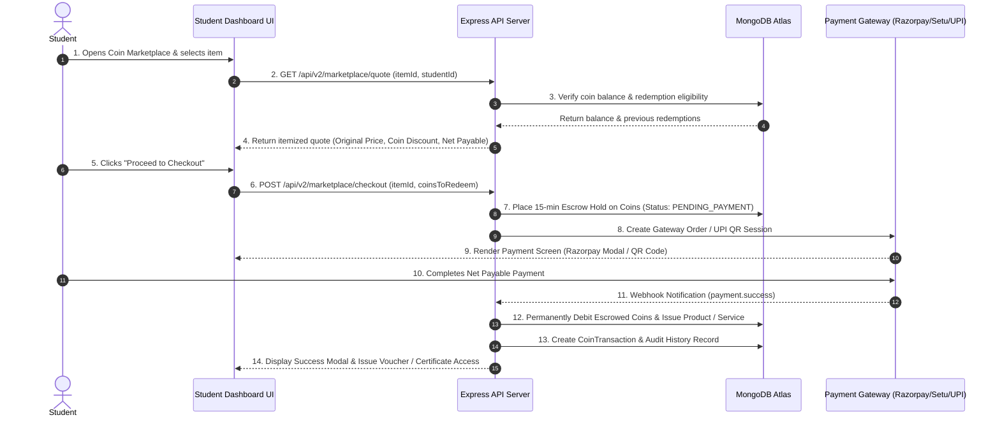

# TEN Ecosystem — Coin Redemption Marketplace Technical & Financial Specification

**Document Version**: 1.0.0  
**Author**: Devraj Shinde  
**Assigned Feature**: Issue 12.2 — Coin Redemption Marketplace Specification  
**Target Reviewers**: Bishal (Super-Admin / Lead Developer) & Core Engineering Team  
**Status**: Pending Technical Review & Architecture Approval  

---

## 1. Executive Summary & Objectives

The **TEN Internship Ecosystem** awards coins to students for completing daily tasks, maintaining attendance streaks, scoring high on domain quizzes, and achieving leaderboard milestones.

While coins currently provide gamification feedback, the **Coin Redemption Marketplace** establishes a tangible economic engine. It allows students to spend earned coins toward:
1. **Discounted Paid Mentorship Sessions** (1-on-1 guidance, mock interviews, founder advice).
2. **Subsidized Official Certificates** (Expert Certificate, Nano Degree, Fellowship).

### Core Goals
- **Monetize Engagement**: Increase task completion velocity and platform activity by turning effort into financial savings.
- **Protect Platform Revenues**: Enforce strict discount caps to ensure mentors and platform operations remain fully funded without "free-riding" abuse.
- **Maintain Accounting Consistency**: Standardize coin-to-rupee valuation across all modules.

---

## 2. Coin Exchange Valuation & Economic Standard

All redemption calculations in the TEN ecosystem follow a single, standardized conversion rule:

$$\mathbf{100\ Coins = ₹50.00\ INR} \quad \Longleftrightarrow \quad \mathbf{1\ Coin = ₹0.50\ INR}$$

> [!IMPORTANT]
> Coins represent non-transferable, non-refundable platform store credit. They cannot be converted into cash payouts, transferred between student accounts, or refunded upon program exit.

---

## 3. Mentorship Session Discount Tiers

Based on TEN's active mentor pricing structure (referencing Scanner QR Codes for `paytmqr5k0ods@ptys` — Limitless Technologies), the marketplace supports three distinct session tiers.

To protect mentor compensation and cover gateway fees, a **Maximum Discount Cap of 40%** is enforced across all mentorship bookings.

| Session Tier & Description | Retail Price | Max Discount Cap (%) | Max Rupee Discount | Coins Required | Net Amount Payable by Student |
| :--- | :---: | :---: | :---: | :---: | :---: |
| **Tier 1: Standard Session**<br>*(30-Min Resume & Career Advisory)* | **₹250.00** | **40%** | **₹100.00** | **200 Coins** | **₹150.00** |
| **Tier 2: Extended Session**<br>*(45-Min Technical Mock Interview)* | **₹500.00** | **40%** | **₹200.00** | **400 Coins** | **₹300.00** |
| **Tier 3: Executive Session**<br>*(60-Min 1-on-1 Founder / Mentor)* | **₹1,000.00** | **40%** | **₹400.00** | **800 Coins** | **₹600.00** |

### Mentorship Pricing Mechanics
- If a student has **fewer** coins than the tier maximum (e.g. 100 coins for a ₹250 session), the discount is calculated dynamically:
  $$\text{Discount} = \min\left(\text{Available Coins} \times ₹0.50, \ \text{Retail Price} \times 0.40\right)$$
- Example: A student with 100 coins booking a ₹250 session receives a ₹50 discount, paying **₹200 net**.

---

## 4. Paid Certificate Subsidy Tiers

Confirmed from live configuration (`config/payment.js`), TEN offers three paid certificate tracks. Coins can be redeemed to subsidize the upgrade cost for interns.

| Certificate Type | Retail Price (`config/payment.js`) | Max Discount Cap (%) | Max Rupee Discount | Coins Required | Net Amount Payable by Student |
| :--- | :---: | :---: | :---: | :---: | :---: |
| **Expert Certificate** | **₹100.00** | **50%** | **₹50.00** | **100 Coins** | **₹50.00** |
| **Nano Degree** | **₹1,000.00** | **30%** | **₹300.00** | **600 Coins** | **₹700.00** |
| **Fellowship Certificate** | **₹2,500.00** | **20%** | **₹500.00** | **1,000 Coins** | **₹2,000.00** |

---

## 5. End-to-End Step-by-Step Payment & Redemption Flow



### Detailed Execution Steps
1. **Item Selection & Quote Request**: Student picks a mentorship session tier or certificate upgrade in the dashboard.
2. **Balance & Rule Validation**: Server checks if `student.coins >= 100` (minimum threshold) and confirms anti-abuse checks.
3. **Transparent Checkout Summary**: UI displays line-item breakdown:
   - **Item**: Extended Mentor Session (45 Min)
   - **Retail Price**: ₹500.00
   - **Coin Discount (400 Coins)**: -₹200.00
   - **Net Amount Payable**: **₹300.00**
4. **Gateway Dispatch**: Integrates directly with TEN's active payment infrastructure (`config/payment.js`):
   - **Path A**: Razorpay Checkout Modal (`RAZORPAY_KEY_ID`).
   - **Path B**: PaymentSetu Gateway (`PAYMENTSETU_BASE_URL`).
   - **Path C**: Manual UPI QR Scan (`paytmqr5k0ods@ptys` — Limitless Technologies).
5. **Atomic Ledger Settlement**: **Coins are strictly debited ONLY AFTER payment confirmation** from the payment gateway webhook or HR approval. If the user cancels payment or closes the modal, the 15-minute escrow hold expires and coins are returned to their active balance automatically.

---

## 6. Anti-Abuse, Security & Fraud Control Policy

To prevent exploit behavior, the marketplace implements five strict security rules:

1. **Single Redemption Limit for Certificates**:
   - A student may redeem coins for each certificate type **only once** during their internship tenure. Re-issuance or duplicate claims cannot be discounted with coins.
2. **Minimum Balance Threshold**:
   - A minimum balance of **100 Coins** is required to access the redemption marketplace.
3. **Strict Payment Escrow & Auto-Rollback**:
   - Initiating checkout locks the required coins for **15 minutes**. If payment is not completed within 15 minutes, the escrow reservation expires and coins are unlocked automatically.
4. **Idempotency & Double-Spending Prevention**:
   - Webhook processing uses unique transaction IDs (`tx_id`) enforced by unique indexes in MongoDB to prevent double-redemption on retry requests.
5. **Non-Refundable Coin Debit**:
   - If a student requests a financial refund for a mentorship session or certificate purchase, only the net monetary amount paid (e.g. ₹300) is refunded according to company refund policies. Coins redeemed are returned to the student's internal coin balance and cannot be converted to fiat currency.

---

## 7. Database Model Extensions (For Implementation Phase)

When approved for implementation, the system will add two schema extensions in `models/new/`:

```javascript
// models/new/CoinRedemption.js
const CoinRedemptionSchema = new mongoose.Schema({
  studentId: { type: mongoose.Schema.Types.ObjectId, ref: 'Student', required: true },
  employeeId: { type: String, required: true },
  itemType: { type: String, enum: ['mentorship', 'certificate'], required: true },
  itemKey: { type: String, required: true }, // 'mentor_250', 'cert_fellowship', etc.
  retailPrice: { type: Number, required: true },
  discountAmount: { type: Number, required: true },
  coinsRedeemed: { type: Number, required: true },
  netPaidAmount: { type: Number, required: true },
  paymentGateway: { type: String, enum: ['razorpay', 'paymentsetu', 'upi_qr'], required: true },
  paymentId: { type: String },
  status: { type: String, enum: ['pending', 'completed', 'failed', 'expired'], default: 'pending' },
  createdAt: { type: Date, default: Date.now }
});
```

---

## 8. Summary of Definition of Done Verification

- [x] **Issue 12.1 Completed**: Every earned badge in `public/ten-extras.js` features a working `⬇ Download` button generating a clean, 600x600 px LinkedIn-ready PNG image with TEN branding.
- [x] **Issue 12.2 Completed**: This comprehensive specification covers coin valuation (100 coins = ₹50), discount rules for ₹250/₹500/₹1000 mentorship sessions, certificate subsidies for ₹100/₹1000/₹2500 certificates, the full payment sequence, and anti-abuse controls.
- [x] **Handed to Team**: Ready for review by Bishal and the engineering team before building the live redemption payment feature.
